# Industrial Capitalist - User Manual

*A factory-building game about digging things out of the ground, turning them into
more valuable things, and living with the smoke.*

---

## Contents

1. [Installation](#1-installation)
2. [Getting started](#2-getting-started)
3. [The interface](#3-the-interface)
4. [Building and connecting machines](#4-building-and-connecting-machines)
5. [Power](#5-power)
6. [Production chains](#6-production-chains)
7. [Research](#7-research)
8. [Blueprints](#8-blueprints)
9. [Pollution, exhaust stacks and scrubbers](#9-pollution-exhaust-stacks-and-scrubbers)
10. [Money, contracts, loans and the market](#10-money-contracts-loans-and-the-market)
11. [Saving and loading](#11-saving-and-loading)
12. [Machine reference](#12-machine-reference)
13. [Keyboard reference](#13-keyboard-reference)
14. [Troubleshooting](#14-troubleshooting)

---

## 1. Installation

### System requirements

| | |
|---|---|
| **Operating system** | Windows, macOS or Linux |
| **Python** | 3.10 or newer (developed and tested on 3.12) |
| **Display** | 1280 x 720 or larger - the game renders at a fixed 1280 x 720 |
| **Disk** | ~60 MB for the game and its art |
| **Sound** | Optional; the game runs fine without an audio device |

### Dependencies

The game needs exactly one third-party package, pinned in `requirements.txt`:

```
pygame-ce==2.5.5
```

`pygame-ce` is the community edition of pygame. If you already have the original
`pygame` installed, remove it first - the two cannot coexist.

### Installing and launching

```bash
cd Industrial-Capitalist
pip install -r requirements.txt
python3 main.py
```

A window titled *Industrial Capitalist* opens at 1280 x 720.

### First launch

1. A boot sequence types itself out on a terminal-style screen. Press any key to skip it.
2. You land on the main menu, which is a fake shell prompt. **Type `play` and press Enter.**
   (`p`, `1`, `start` and `new` also work; `quit`, `q`, `2` or `exit` leave the game.)
3. A loading screen runs, then the **save slot** list appears. There are three slots.
   Move with the arrow keys or W/S and press Enter, or click a slot's **PLAY** button.
4. Choosing an empty slot asks you to register a company name (1-22 characters),
   plays a short story intro (Esc skips it), and drops you into a brand new world
   with **$1,500** and an empty 40 x 40 plot.
5. A 15-step tutorial panel appears in the top right. Click **NEXT** to page
   through it or **SKIP** to dismiss it.


*The terminal main menu. Type `play` and press Enter.*

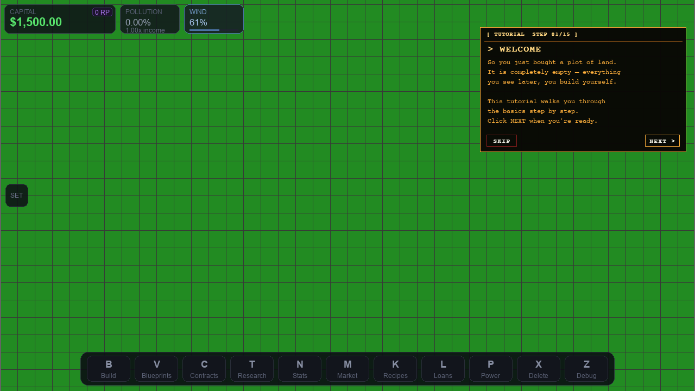
*A fresh game: $1,500, an empty plot, and the tutorial panel top-right.*

### Where saves live

Everything is stored under `data/` next to `main.py`:

| Path | Contents |
|---|---|
| `data/slot_1/`, `slot_2/`, `slot_3/` | One directory per save slot |
| `data/slot_N/world.json` | The grid: every machine, rotation, buffer and power link |
| `data/slot_N/money.json`, `research.json`, `pollution.json`, ... | Economy and progress |
| `data/slot_N/backup_1..3/` | Three rolling backups, rotated on every save |
| `data/blueprints.json` | The blueprint library - **shared by all three slots** |
| `data/*.json` (loose) | The *active* slot's working copy; do not edit by hand |

To back up a save, copy its `data/slot_N/` directory. To move a save to another
machine, copy the same directory across.

### Updating

Pull or copy the new version over the old one, keeping your `data/` directory.
Save files carry no version stamp; layouts made in older versions load fine, and
blueprints saved before power capture existed simply come back without wiring.

### Common installation problems

| Symptom | Cause and fix |
|---|---|
| `ModuleNotFoundError: No module named 'pygame'` | Dependencies not installed. Run `pip install -r requirements.txt`. |
| `AttributeError` inside pygame on start-up | The original `pygame` is installed alongside `pygame-ce`. `pip uninstall pygame pygame-ce`, then `pip install -r requirements.txt`. |
| The window opens but is cut off | The layout is fixed at 1280 x 720. Increase your display resolution or scaling. |
| No sound | Harmless. The game continues without an audio device. |
| `data/` errors on start-up | The game creates `data/` at runtime; make sure the game directory is writable. |
| A corrupted save | The game prints a warning and starts that file fresh. Restore `data/slot_N/backup_1/` over `data/slot_N/` to recover. |

---

## 2. Getting started

Your goal is to make money. You do that by extracting raw material, processing it
into something worth more, and selling the result at a depot. Everything else -
power, research, pollution - exists to support or complicate that loop.

### Your first five minutes

1. **Place a Coal Drill.** Press `B`, type `coal` in the search box, click the
   **Coal Drill** tile, press `T`, then click a grid square. It costs $150.
2. **Give it power.** Press `B` again, search `solar`, place a **Solar Panel**
   ($120) within three tiles of the drill.
3. **Wire the two together.** Press `P` for power mode, click the solar panel,
   then click the drill. A yellow line appears. Press `P` again to leave power mode.
   *Nothing is powered until it is wired* - being close is not enough.
4. **Give the coal somewhere to go.** Press `Z` to show every machine's input and
   output tiles. The Coal Drill's red output marker is on its **bottom** edge, so
   place a **Van Depot** ($500) in the square directly **below** the drill.
5. **Wait.** The depot fills, a truck collects, and your capital starts climbing.

That is the whole game in miniature: extract -> move -> sell.

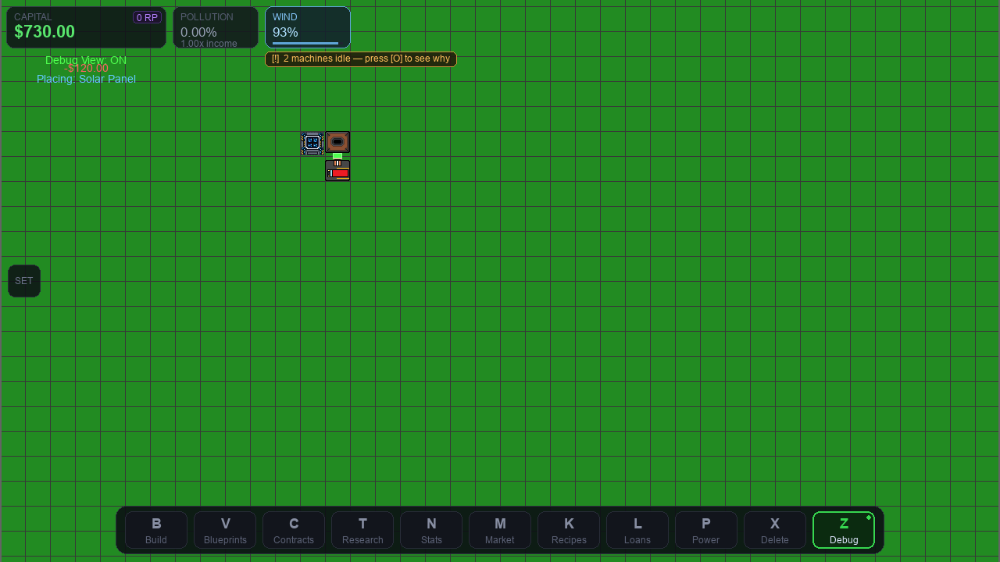
*Press `Z` to reveal ports. Green marks where items can enter, red where they leave,
orange marks a secondary output (a by-product).*

### Scaling up

One drill earns roughly $2 per second. Depots are the expensive part, so feed
several drills into one depot with **Pipes** and a **Merger** rather than buying a
depot each. A Van Depot can absorb about three Coal Drills.

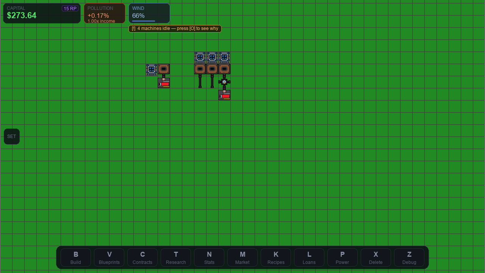
*Three coal drills, two pipes and a merger feeding a single Van Depot.*

---

## 3. The interface

### The HUD (top left)

| Card | Meaning |
|---|---|
| **CAPITAL** | Your money, and your banked **RP** (Research Points) in the purple badge |
| **POLLUTION** | Current pollution percentage and the income multiplier it costs you |
| **WIND** | Current wind strength - wind turbines produce proportionally to this |

An amber banner appears under the HUD when machines are sitting idle:
`[!] N machines idle - press [O] to see why`.

### The toolbar (bottom)

`B` Build . `V` Blueprints . `C` Contracts . `T` Research . `N` Stats .
`M` Market . `K` Recipes . `L` Loans . `P` Power . `X` Delete . `Z` Debug

Click a button or press its letter. `Esc` closes whatever is open.

### The machine panel (right)

Click any placed machine to inspect it. The panel shows its coordinates and
rotation, cost and resale value, a one-line **status** (`RUNNING`, `NO POWER`,
`OUTPUT FULL`, `NEEDS CEMENT, AGGREGATE, WATER`), its power bar, its recipe
modes, and the live contents of every buffer.

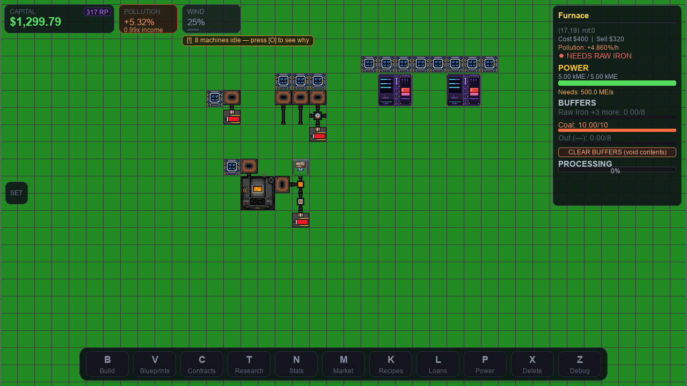
*The machine panel: status, power, recipe mode and live buffers.*

### The camera

* **W A S D** - pan. (Disabled while you are typing in a search box.)
* **Scroll wheel** - zoom, centred on the cursor.
* The plot is 40 x 40 tiles; the view starts centred on it.

---

## 4. Building and connecting machines

### Placing

1. `B` opens the build panel.
2. Type in the search box to filter, or scroll the categories:
   **Power, Logistics, Extractors, Processing, Storage, Utility, Logic**.
3. Click a machine to select it. The left pane shows its cost, size, power draw,
   what it consumes and what it produces.
4. Click **Start Placing** or press `T`.
5. `R` rotates the ghost in 90 deg steps. Click a grid square to build.
6. Hold **Shift** while clicking to keep the tool active and place several.

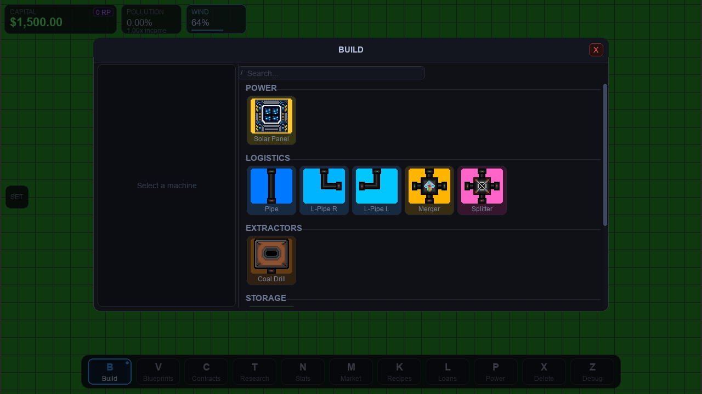
*The build panel. Search, pick, then `T` to place.*

Machines larger than one tile are anchored at the square you click, extending
right and down. You cannot build on top of anything.

### Removing

`X` enters delete mode; click a machine to sell it back for **80 %** of its cost.
Delete mode switches itself off after one click - **hold Shift** to keep deleting.
To clear an area, drag a box over empty ground, then press `Y` to confirm or `N`
to cancel.

### Ports: how machines actually connect

Every machine has fixed **input** and **output** tiles, and they only work in one
direction. Press `Z` to see them:

* **Green** - an input. Items must arrive from the side the marker sits on.
* **Red** - the main output. Items leave in that direction.
* **Orange** - a secondary output, used by machines that make a by-product
  (Diesel Refinery residue, Raw Mill aggregate, Steam Cracker ethylene, ...).

Rotating a machine with `R` rotates its ports with it. A machine whose output
faces a wall, or whose input faces nothing, will simply sit there.

### Moving items

* **Pipes** carry items in the direction they were laid. Click and drag to run a
  line; corners are chosen automatically.
* **Mergers** combine three input lanes into one output.
* **Splitters** divide one input across three outputs.
* **Intersections** let two lines cross without mixing.
* Pipes come in three tiers - standard, **Adurite** (60 capacity, 40 items/s) and
  **Iridium** (200 capacity, 120 items/s).

Machines can also feed each other **directly**, with no pipe at all, if one
machine's output tile is adjacent to the other's input tile and they face each
other. Direct feeding is the cheapest and fastest option; use it whenever the
geometry allows.

---

## 5. Power

Power is measured in **ME/s** (machine energy per second) and behaves like a
budget, not a battery: each machine drains its `power_input` every second and
runs at full speed only while its stored power stays above that figure. A machine
at half its required power runs at half speed.

### Generating

| Generator | Output | Notes |
|---|---|---|
| **Solar Panel** | 280 ME/s | Available from the start. Clean. 3-tile range. |
| **Coal Generator** | 7,000 ME/s | 15 RP. Burns coal, and pollutes. 4-tile range. |
| **Wind Turbine 1** | 1,500 ME/s x wind | 30 RP. Clean, but output follows the WIND meter. |
| **Diesel / Gasoline Generator** | 90-120 kME/s | Mid-game; needs refined fuel. |
| **Steam Turbine, Coal Power Plant, Nuclear** | 500 kME/s - 1.32 GME/s | End-game. |

### Wiring

1. Press `P`. The screen enters power mode.
2. Click a **generator, pole or battery**. Its range is drawn as a square.
3. Click a **machine inside that square**. The link is made and drawn as a line.
4. Press `P` again to leave power mode.

Clicking an existing link again removes it. Clicking outside the range gives
*"Out of range!"* - move the generator closer, or relay the power with an
**LV / MV / HV Pole**.

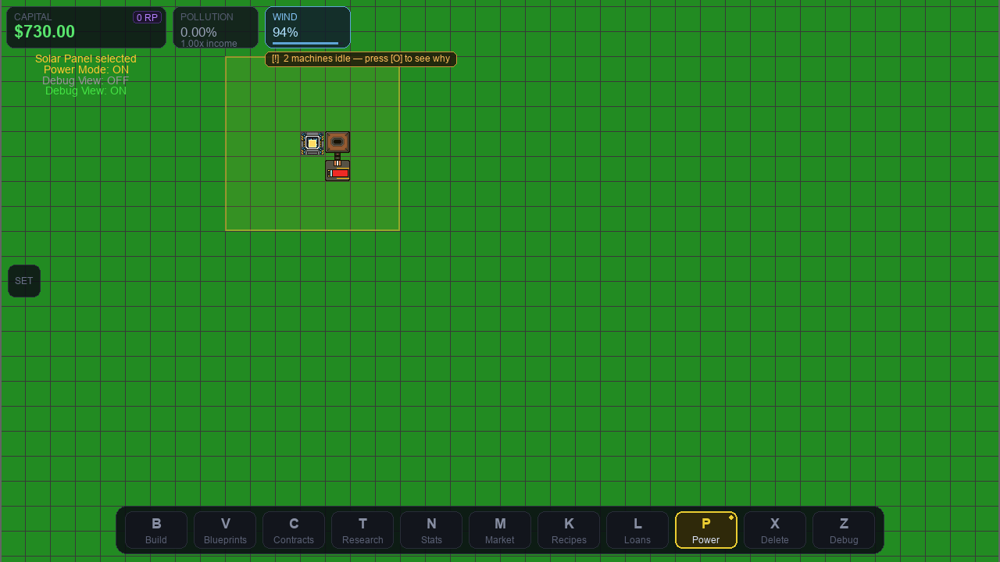
*Power mode: the highlighted square is everything this generator can reach.*

### Branching a power line

Poles **relay** power, they do not store it. A pole with something downstream
will read close to zero itself while it passes everything along - that is normal
and not a fault. Only the last pole in a run, or one feeding machines, holds a
visible charge.

You can branch: one pole can feed several downstream poles or machines, and each
branch gets an equal share of what the source holds. If a branch is still dark,
check its distance rather than assuming the split failed.

### Ranges

| Source | Range |
|---|---|
| Solar Panel | 3 tiles |
| Coal Generator | 4 tiles |
| LV Pole | 2 tiles |
| MV Pole | 3 tiles |
| HV Pole | 10 tiles |
| Diesel Generator | 10 tiles |

Range is measured from the source to the **nearest tile** of the target machine,
including diagonals, so it matches the square you see on screen.

### Bootstrapping a Coal Generator

A Coal Generator needs coal, and the drill that feeds it needs power. **Do not
wire that drill to the generator it feeds** - you get a deadlock where neither
ever starts. Power the feeding drill from a Solar Panel instead, and use the
generator's output for everything else.

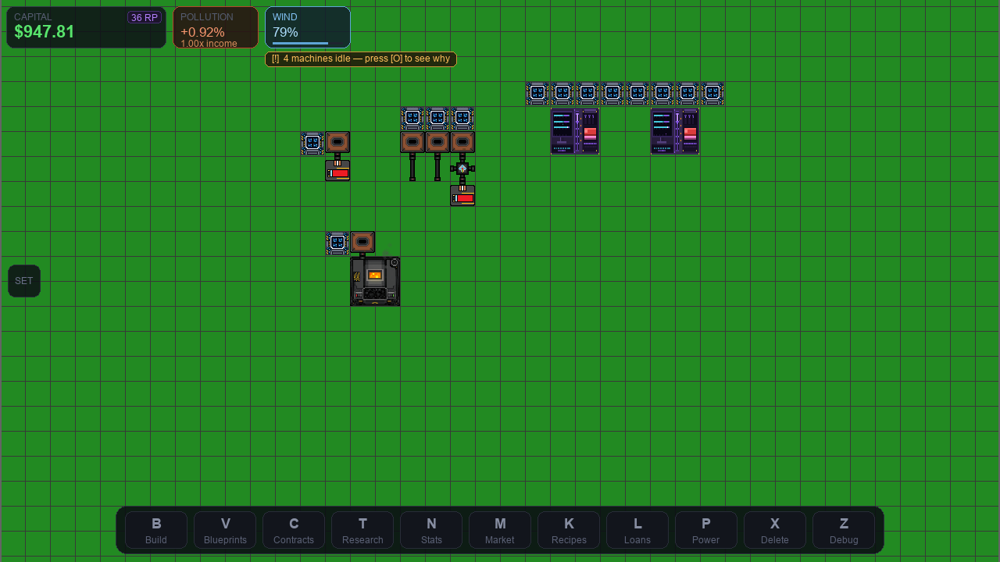
*The drill above the generator is powered by its own solar panel, so the
generator can always start.*

---

## 6. Production chains

Raw material is nearly worthless; the money is in the number of steps you put
between the ground and the depot.

### The iron chain (the first real one)

```
Iron Drill  --raw_iron-->  Furnace  --liquid_iron-->  Ingot Molder  --iron_ingot-->  Van Depot
                             ^
                          coal (from a Coal Drill to its left)
```

| Stage | Machine | Consumes | Produces | Value |
|---|---|---|---|---|
| Extract | Iron Drill | - | `raw_iron` | $5.80 |
| Smelt | Furnace | 1 `raw_iron` + 1 `coal` | `liquid_iron` | $23.20 |
| Cast | Ingot Molder | 4 `liquid_iron` | 2 `iron_ingot` | $65.54 each |

Every machine here pushes **downwards**, so the chain builds as a vertical
column, with the furnace's coal arriving from the side.

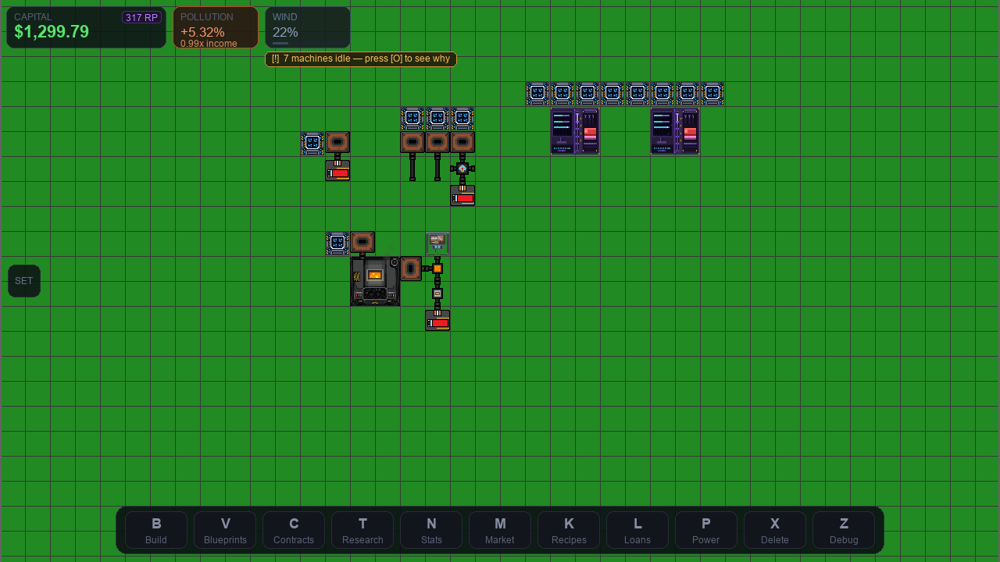
*Iron drill, furnace, ingot molder and depot in a column, with a rotated coal
drill feeding the furnace from the left.*

### Reading a recipe

Machines with more than one recipe show a **RECIPE MODE** list in their panel.
Each row is named after what it **makes**; under the list, **Needs:** shows what
the currently selected mode consumes.

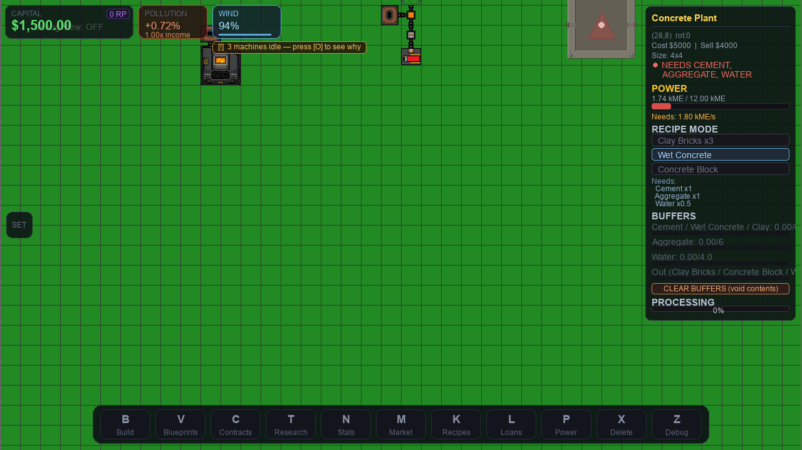
*A Concrete Plant set to Wet Concrete: the list shows the three products, and
"Needs" shows the ingredients for the selected one.*

Press `K` for the **Recipe Book**, which lists every item in the game with its
sell value, its RP value, which machines make it, and which recipes consume it.
It is the fastest way to plan a chain.

### Longer chains

Later branches follow the same pattern with more steps:

* **Construction** - Quarry -> limestone/clay -> Raw Mill -> rawmix -> Industrial
  Kiln -> cement -> Concrete Plant -> concrete blocks.
* **Oil** - Oil Rig -> crude -> Diesel Refinery (three stages: crude -> poor quality
  diesel -> diesel -> refined diesel) -> Filtration Plant -> machine oil.
* **Chemistry** - crude/gas -> Steam Cracker, Chemical Reactor, Chemical Plant ->
  acids, plastics, lithium.
* **Assembly** - Craft Assembler and Advanced Assembler combine intermediates
  into high-value goods (gearboxes, tyres, microchips).

---

## 7. Research

### Research Points

RP is produced by **Research Stations**, which need only power - no inputs.

| Station | Cost | Power | Rate | Unlocked by |
|---|---|---|---|---|
| **Research Station 1** | $75, 2 x 2 | 900 ME/s | 0.5 RP/s per station | available from the start |
| **Research Station 2** | $7,500, 4 x 4 | 8 kME/s | fed with items: 10 RP x the item's RP value, every 2 s | Research Station 2 (400 RP) |
| **Research Station 3** | $250,000, 5 x 5 | 20 kME/s | two item feeds: 25 RP x value, every 0.5 s | Research Station 3 (2,500 RP) |

**Research Station 1 has a soft cap.** A single station stops generating once you
have banked 200 RP; the ceiling rises as you add more (317 RP with two, 400 with
three, 464 with four). This is deliberate: to go further you must either build
more stations or move to the item-fed Research Station 2, which has no such cap.
If your RP has stopped climbing and your station shows *RUNNING*, you have hit
the cap - build another one.

Research Stations 2 and 3 are in the **PROD** (production) branch of the tech
tree, at tiers 3 and 5.

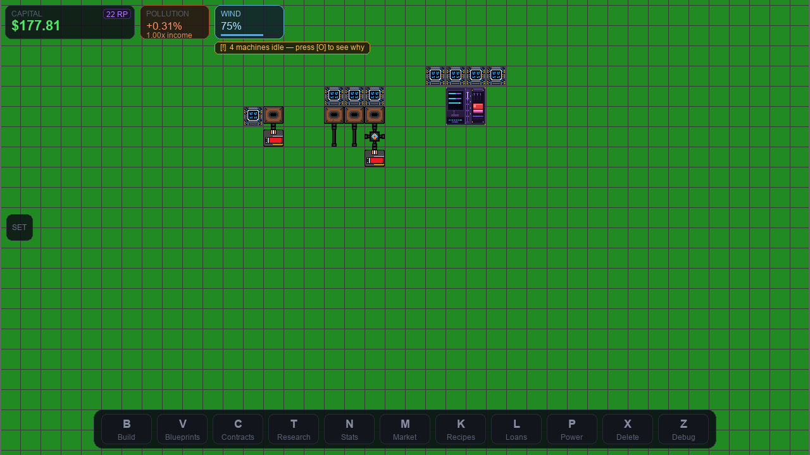
*Research Station 1 with the four solar panels that run it.*

### The tech tree

Press `T`. The tree is split into four branches, selected with the tabs at the
top left:

| Tab | Branch | Covers |
|---|---|---|
| **PROD** | Production | Smelting, metals, construction, assembly, Research Stations 2 & 3 |
| **LOGI** | Logistics | Water, silos, pipe tiers, depots, **Atmospherics** |
| **RFNG** | Refining | Oil, gas, plastics, chemistry, lithium, gold |
| **POWR** | Power | Generators, poles, batteries, logic gates |

Scroll to zoom, drag to pan. Hovering a node highlights its ancestors and
descendants and dims the rest. Each node shows its name, what it unlocks, its RP
cost, and either a green **RESEARCH** button, `Need N more`, or its missing
prerequisite.

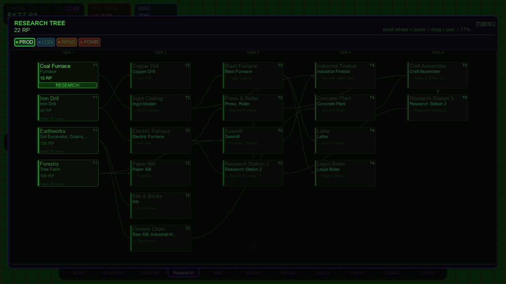
*The production branch. Nodes you can afford show a RESEARCH button.*

### A sensible opening order

| Tech | RP | Why |
|---|---:|---|
| Coal Generator | 15 | Fixes power permanently; everything else is gated on power |
| Coal Furnace | 15 | The first processing step, and the gateway to refining |
| Iron Drill | 40 | The first genuinely profitable raw material |
| Ingot Casting | 60 | Turns liquid iron into $65 ingots |
| Atmospherics | 120 | Exhaust stacks and scrubbers, before pollution starts biting |

---

## 8. Blueprints

A blueprint stores a rectangle of your factory - the machines, their rotations,
their recipe modes, **and the power wiring between them** - so you can stamp the
same layout out again.

### Creating one

1. Press `G`. The cursor enters blueprint-select mode.
2. Drag a box over the machines you want. Anything whose origin tile falls inside
   the box is captured.
3. On release the selection becomes your **clipboard** and you switch straight to
   paste mode. Click anywhere to stamp a copy; right-click, `G` or `Esc` cancels.

### Saving one to the library

With something on the clipboard, press `V` to open the blueprint library and
click **SAVE CLIPBOARD**, type a name and press Enter.

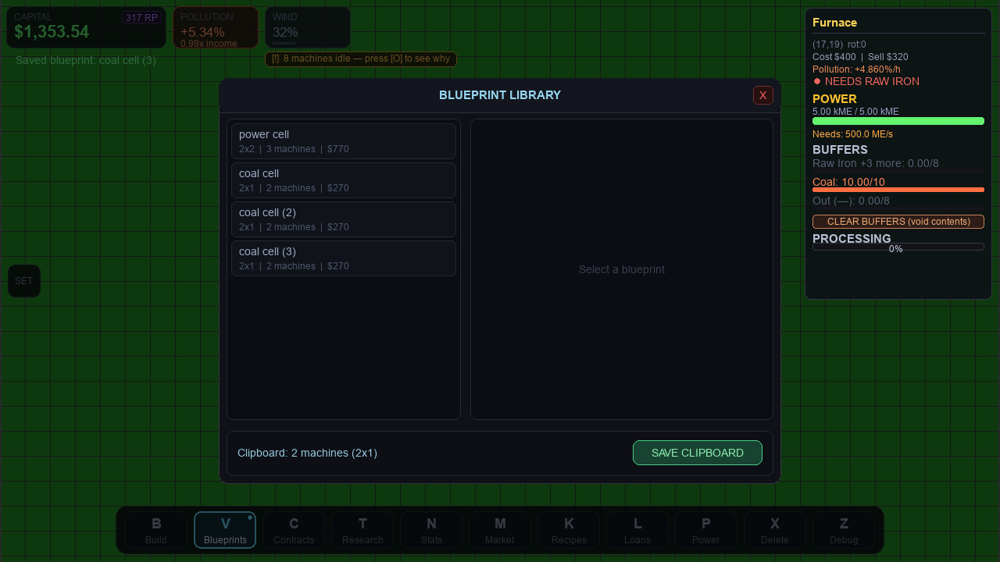
*The blueprint library. Saved layouts persist across all three save slots.*

### Placing from the library

Press `V`, click a row to select it, click **PLACE**, then click the world. The
cost of the whole stamp is shown before you commit.

### Sharing a blueprint as a string

Any blueprint can be turned into a single line of text and back again.

* **Export** - select a blueprint in the library and click **EXPORT STRING**.
  The string is copied to your clipboard and also written to
  `data/blueprint_strings/<name>.txt`, so it survives even if the clipboard is
  unavailable.
* **Import** - click **IMPORT STRING**. Anything already on your clipboard is
  pasted in for you; otherwise press **Ctrl+V** (**Cmd+V** on macOS) or type it.
  Press **Enter** to add it to your library.

Strings begin with `IC1:` - the format version. Whitespace and line breaks
inside one are ignored, so a string is safe to paste out of a chat window or a
text file. A string from a newer version of the game, or a corrupted one, is
rejected with a message rather than placing something wrong.

Ready-made, ratio-perfect layouts ship in the `tutorial/` folder.

### What is and is not stored

| Stored | Not stored |
|---|---|
| Machine types and positions | Buffer contents / items in flight |
| Rotations | Power *levels* |
| Recipe modes | Links that pointed outside the selection |
| Power connections between captured machines | Money |

A pasted blueprint skips any machine you cannot afford or have not researched
yet, and tells you how many it skipped. Power links to a skipped machine are
dropped rather than left dangling.

The library lives in `data/blueprints.json` and is **shared by every save slot**.

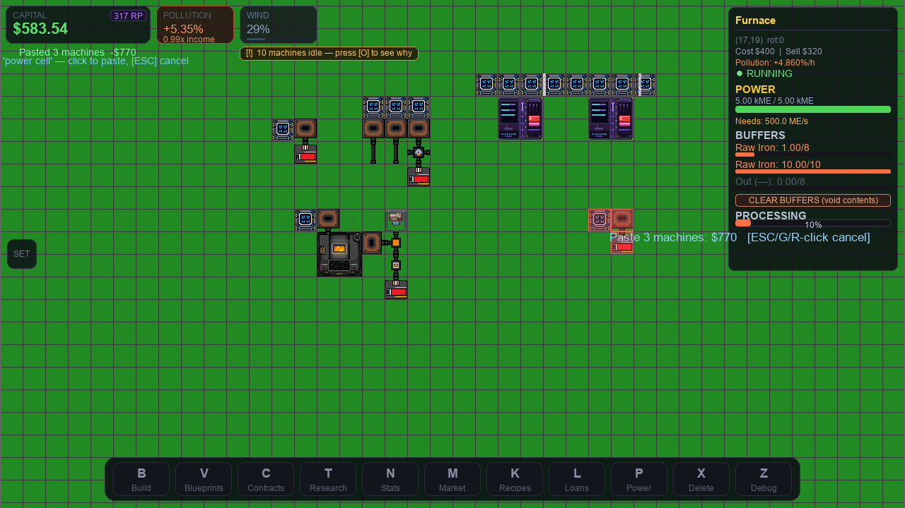
*The same cell pasted elsewhere - the power link came back with it, so the drill
runs immediately.*

---

## 9. Pollution, exhaust stacks and scrubbers

### How pollution works

Drills, furnaces and fuel-burning generators emit pollution, measured in **% per
hour**. A machine only pollutes while it is actually working - a stalled drill is
a clean drill. The total sits in the HUD, and it costs you money:

| Pollution | Income multiplier |
|---:|---|
| 0 % | 1.00x |
| 50 % | 0.95x |
| 100 % | 0.90x |
| 200 % | 0.80x |
| 500 % | 0.50x |
| 1000 %+ | 0.10x |

Let it run away and **protesters** eventually blockade your depots, stopping
sales entirely until pollution comes back down.

### The two cleaners

Both are unlocked by **Atmospherics** (120 RP, Logistics branch).

| | **Exhaust Stack** | **Scrubber** |
|---|---|---|
| Cost | $900 | $1,500 |
| Size | 2 x 3 | 2 x 2 |
| Power | **none** | 5,000 ME/s |
| Removes | 5.4 %/h, always | 28.8 %/h at full power |
| Inputs | none | none |
| Outputs | none | **7.5 residue/min** |

Neither takes any item input - you do not pipe exhaust *to* them. The difference
is on the way out:

* An **Exhaust Stack disperses**. It thins the pollution out and leaves nothing
  behind, so it can never clog and never needs attention.
* A **Scrubber captures**. It pulls the pollutants out of the air, and that
  captured matter has to go somewhere - it fills with **residue** at
  7.5 per minute and pushes it out of the tile at its bottom-left corner.

**A Scrubber whose residue has nowhere to go stops scrubbing.** Its buffer holds
8; once that is full the panel reads *RESIDUE FULL* and pollution starts climbing
again. Pipe the output into a **Liquid Burner**, which destroys it, or into a
depot - though residue sells for **-$8**, so burning it is usually cheaper.

**Use the Exhaust Stack** as a cheap always-on baseline that can never fail and
never needs plumbing. **Use the Scrubber** once you have real power and somewhere
to put the waste: it removes more than five times as much for the same
footprint. A Scrubber below full power scrubs proportionally less; with no power
at all it does nothing.

A worked pairing: one Coal Power Block emits 21.6 %/h, one Scrubber removes
28.8 %/h, and one Liquid Burner clears far more residue than a single Scrubber
makes - so *Coal Power Block + Scrubber + Liquid Burner* runs clean.

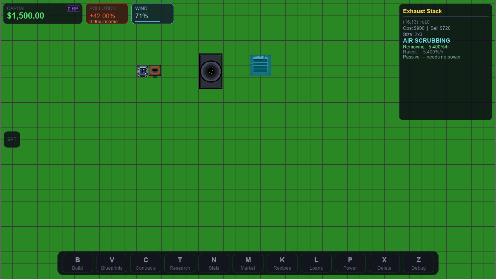
*An Exhaust Stack reporting what it removes. "Passive - needs no power."*

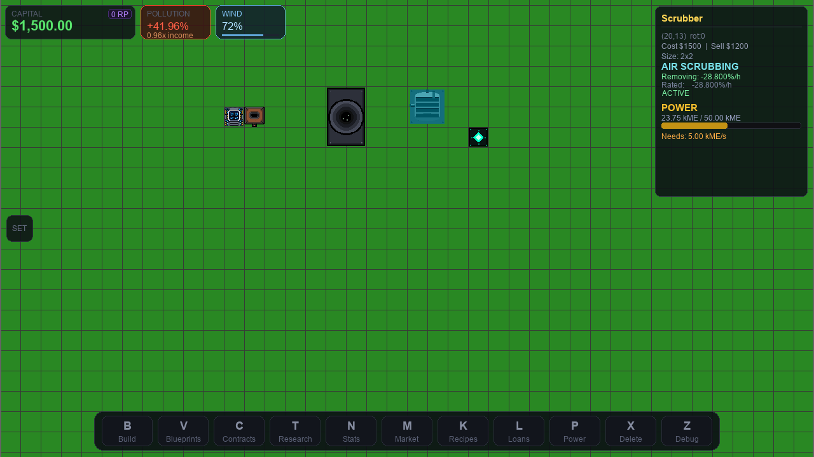
*A powered Scrubber: removing its full rated 28.8 %/h, marked ACTIVE.*

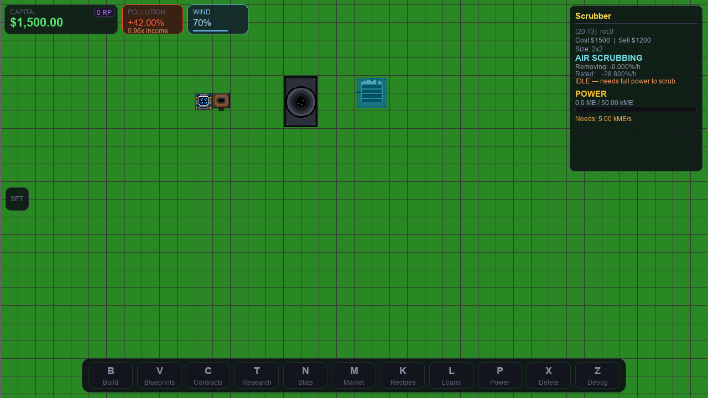
*The same Scrubber with no power: "Removing -0.000 %/h" and
"IDLE - needs full power to scrub". This is the state to look for when pollution
will not come down.*

### Reading the pollution ledger

Press `N` for **Statistics**. The **POLLUTION** section gives you the whole
picture: the current level and its income multiplier, gross **Emitted**, gross
**Scrubbed**, and the **Net** figure. Negative net means the air is getting
cleaner. A one-line hint below tells you what to do next.

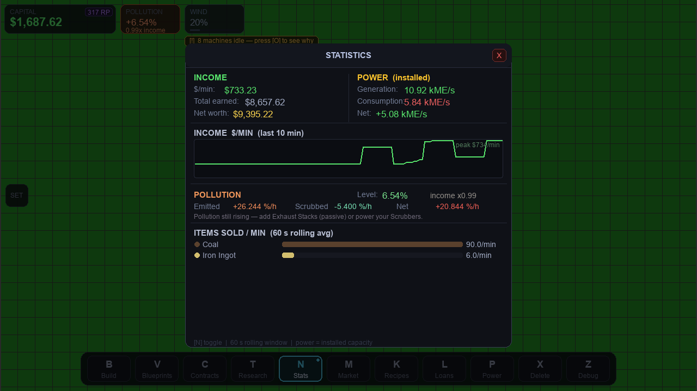
*The pollution ledger: emitted, scrubbed, and the net rate.*

---

## 10. Money, contracts, loans and the market

* **Depots** are the only way to turn goods into money. Each has a capacity, a
  sell threshold and a bonus multiplier - a Van Depot sells once it is half full
  and pays 0.9x, while the Huge Truck Depot pays 1.25x.
* **Contracts** (`C`) are goals - sell 20 coal, spend $X on machines - that pay
  out money and RP. Your first one, *First Steps*, is achievable within a minute.
* **Loans** (`L`) give you capital now against interest later. Useful to buy the
  first Research Station or a Scrubber during a pollution crisis.
* **The Market** (`M`) shows supply and demand per item; prices drift as you flood
  a market with a product.

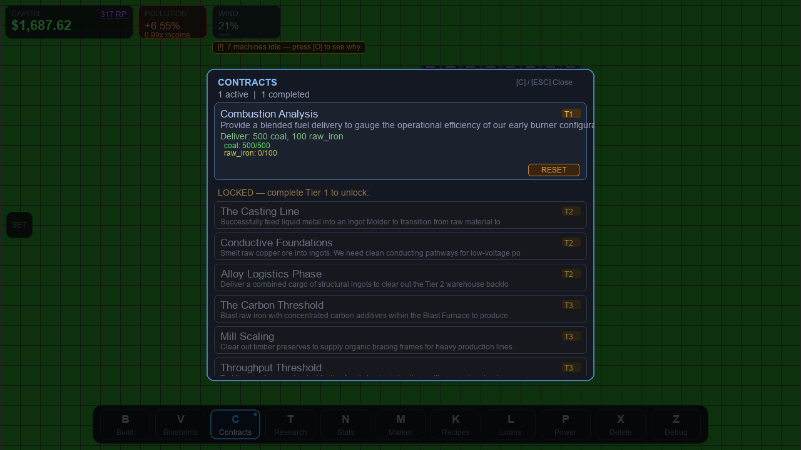
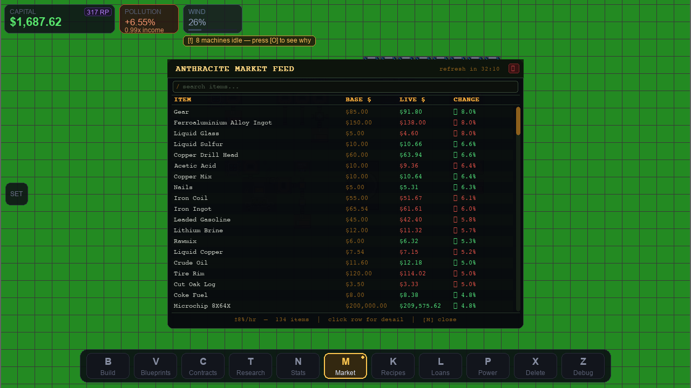
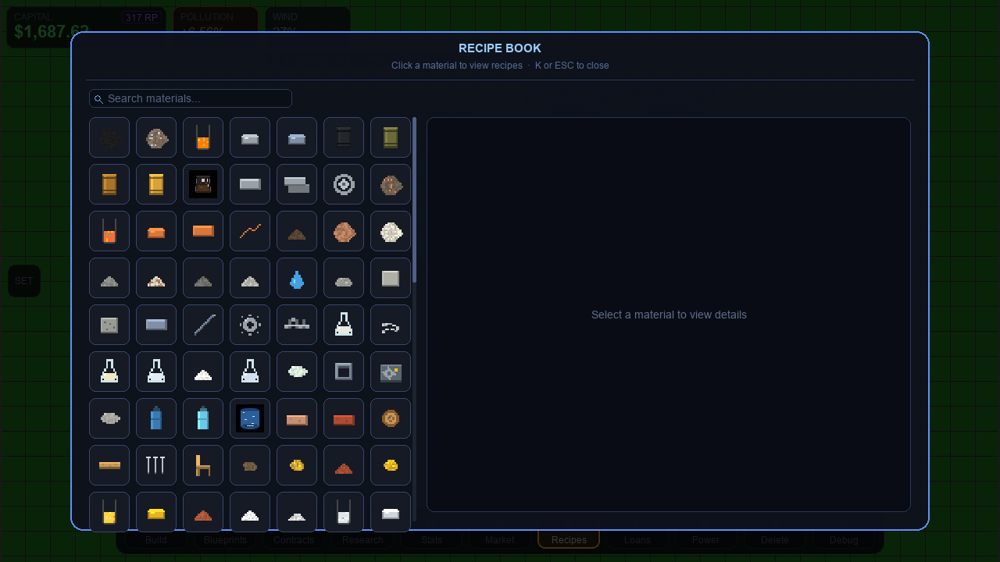

---

## 11. Saving and loading

* **Ctrl+S** saves immediately. The word `SAVED` flashes under the HUD.
* The game also saves when you quit, and rotates three backups per slot on each
  save.
* **Loading**: from the main menu type `play`, choose the slot, press Enter (or
  click **PLAY**). Choosing a slot that already has a world loads it directly -
  no company-name prompt, no story intro.
* **Deleting a slot**: click **DELETE** on its row and confirm with `Y`.

What is preserved: every machine with its rotation and origin, all buffers and
items inside machines, all power connections, money, pollution, RP and researched
techs, contracts, loans, market state, and depot sale totals. Blueprints live
outside the slots and are never lost when you delete a save.

---

## 12. Machine reference

Power figures are the machine's own draw (or output). "Unlocked by" names the
technology; *start* means it is available in a brand-new game.


### Power

| Machine | Cost | Size | Power | Inputs | Outputs | Unlocked by |
|---|---:|:---:|---|---|---|---|
| **Solar Panel** | $120 | 1x1 | 280 ME/s out | - | - | start |
| **Solar Panel 2** | $700 | 1x1 | 528 ME/s out | - | - | Solar Panel 2 |
| **Solar Panel 3** | $80,000 | 1x1 | 1.056 kME/s out | - | - | Solar Panel 3 |
| **Wind Turbine 1** | $400 | 2x2 | 1.5 kME/s out | - | - | Wind Turbine 1 |
| **Wind Turbine 2** | $20,000 | 2x2 | 16 kME/s out | - | - | Wind Turbine 2 |
| **Wind Turbine 3** | $150,000 | 3x3 | 50 kME/s out | - | - | Wind Turbine 3 |
| **Coal Generator** | $160 | 2x2 | 7 kME/s out | - | - | Coal Generator |
| **Diesel Generator** | $30,000 | 2x1 | 90 kME/s out | diesel, poor quality diesel, refined diesel | - | Diesel Generator |
| **Steam Turbine** | $18,000 | 3x3 | 500 kME/s out | steam | - | Steam Turbine |
| **Gasoline Generator** | $35,000 | 2x2 | 120 kME/s out | gasoline | - | Gasoline Generator |
| **Coal Power Plant** | $2,500,000 | 12x12 | 500 MME/s out | coal, water | - | Coal Power Plant |
| **Nuclear Power Plant** | $1,200,000 | 16x16 | 1.32 GME/s out | control rod, distilled water, fuel rod | spent fuel | Nuclear Power Plant |
| **LV Pole** | $5 | 1x1 | - | - | - | LV Poles |
| **MV Pole** | $500 | 1x1 | - | - | - | MV Poles |
| **HV Pole** | $300,000 | 2x2 | - | - | - | HV Power Network |
| **MV Battery** | $5,000 | 2x2 | - | - | - | MV Battery |
| **HV Battery** | $250,000 | 2x2 | - | - | - | HV Power Network |
| **HV Transformer** | $200,000 | 2x3 | 10 kME/s in | machine oil, water | - | HV Power Network |
| **Electric Water Heater** | $5,000 | 2x2 | 50 kME/s in | water | steam | Electric Water Heater |
| **Infinite Generator** | $0 | 1x1 | 1 EME/s out | - | - | start |

### Logistics

| Machine | Cost | Size | Power | Inputs | Outputs | Unlocked by |
|---|---:|:---:|---|---|---|---|
| **Pipe** | $10 | 1x1 | - | - | - | start |
| **L-Pipe R** | $2 | 1x1 | - | - | - | start |
| **L-Pipe L** | $2 | 1x1 | - | - | - | start |
| **Merger** | $10 | 1x1 | - | - | - | start |
| **Splitter** | $10 | 1x1 | - | - | - | start |
| **Pipe Intersection** | $15 | 1x1 | - | - | - | Pipe Crossings |
| **Adurite Pipe** | $150 | 1x1 | - | - | - | Adurite Pipework |
| **Adurite L-Pipe R** | $50 | 1x1 | - | - | - | Adurite Pipework |
| **Adurite L-Pipe L** | $50 | 1x1 | - | - | - | Adurite Pipework |
| **Adurite Merger** | $120 | 1x1 | - | - | - | Adurite Pipework |
| **Adurite Splitter** | $120 | 1x1 | - | - | - | Adurite Pipework |
| **Adurite Intersection** | $180 | 1x1 | - | - | - | Adurite Pipework |
| **Iridium Pipe** | $1,200 | 1x1 | - | - | - | Iridium Pipework |
| **Iridium L-Pipe R** | $200 | 1x1 | - | - | - | Iridium Pipework |
| **Iridium L-Pipe L** | $200 | 1x1 | - | - | - | Iridium Pipework |
| **Iridium Merger** | $500 | 1x1 | - | - | - | Iridium Pipework |
| **Iridium Splitter** | $500 | 1x1 | - | - | - | Iridium Pipework |
| **Iridium Intersection** | $750 | 1x1 | - | - | - | Iridium Pipework |

### Extractors

| Machine | Cost | Size | Power | Inputs | Outputs | Unlocked by |
|---|---:|:---:|---|---|---|---|
| **Coal Drill** | $150 | 1x1 | 120 ME/s in | - | coal | start |
| **Iron Drill** | $1,200 | 1x1 | 1.2 kME/s in | - | raw iron | Iron Drill |
| **Copper Drill** | $1,100 | 1x2 | 1 kME/s in | - | raw copper | Copper Drill |
| **Soil Excavator** | $400 | 2x2 | 200 ME/s in | - | clay, soil | Earthworks |
| **Quarry** | $1,500 | 4x4 | 800 ME/s in | - | clay, earth fragment, limestone, sand | Earthworks |
| **Water Pump** | $500 | 2x2 | 600 ME/s in | - | water | Water Pumping |
| **Natural Gas Well** | $18,000 | 2x2 | 800 ME/s in | - | raw gas | Natural Gas |
| **Tree Farm** | $1,500 | 3x3 | 500 ME/s in | - | oak log | Forestry |
| **Lithium Ore Drill** | $95,000 | 2x2 | 45 kME/s in | - | lithium ore | Lithium Ore Drill |
| **Mineshaft Drill** | $180,000 | 3x3 | 8 kME/s in | - | deep earth fragment, raw lead, raw zinc, uranium ore | Mineshaft Drill |
| **Lithium Brine Extractor** | $150,000 | 3x3 | 3 kME/s in | - | lithium brine | Lithium Brine Extractor |
| **Air Separation Unit** | $110,000 | 3x3 | 4 kME/s in | - | oxygen | Air Separation Unit |
| **Oil Rig** | $22,000 | 2x1 | 15 kME/s in | - | crude oil | Oil Rig |

### Processing

| Machine | Cost | Size | Power | Inputs | Outputs | Unlocked by |
|---|---:|:---:|---|---|---|---|
| **Electric Furnace** | $1,200 | 2x2 | 24 kME/s in | raw copper, raw iron, sand | liquid copper, liquid glass, liquid iron | Electric Furnace |
| **Furnace** | $400 | 1x1 | 500 ME/s in | coal, raw copper, raw iron, raw lead, raw zinc | - | Coal Furnace |
| **Ingot Molder** | $1,500 | 1x1 | 1.5 kME/s in | liquid aluminium, liquid copper, liquid glass, liquid gold, liquid iron | aluminium ingot, copper ingot, ferroaluminium alloy ingot, glass, gold ingot | Ingot Casting |
| **Blast Furnace** | $6,500 | 3x3 | 8 kME/s in | alumina dust, coal, coke fuel, crushed bauxite, iron ingot | alumina, coke fuel, liquid aluminium, steel | Blast Furnace |
| **Foundry** | $500,000 | 6x6 | 50 kME/s in | coal, coke fuel, raw copper, raw iron, raw lead | - | Foundry |
| **Industrial Firebox** | $3,500 | 2x3 | - | coal, coke fuel, oak log | coke fuel, sodium carbonate | Industrial Firebox |
| **Sawmill** | $3,000 | 2x3 | 3 kME/s in | chunk plank, cut oak log, iron ingot, oak log | chunk plank, cut oak log, iron plate, planks | Sawmill |
| **Press** | $2,500 | 2x2 | 6.25 kME/s in | copper ingot, iron ingot, iron plate, paper, planks | copper plate, filter, gear, iron plate, iron plate2 | Press & Roller |
| **Roller** | $2,500 | 2x2 | 1.125 kME/s in | aluminium ingot, copper plate, ferroaluminium alloy ingot, gold ingot, insulated wire | copper wire, electromagnet, ferroaluminium magnet, gold wire, iron coil | Press & Roller |
| **Grinder** | $800 | 2x2 | 4 kME/s in | alumina, bauxite residue, coal, copper ingot, iron ingot | alumina dust, black dye, copper mix, copper powder, crushed bauxite | Earthworks |
| **Raw Mill** | $3,500 | 3x3 | 1.2 kME/s in | clay, gravel, limestone | - | Cement Chain |
| **Industrial Kiln** | $5,500 | 4x6 | 2.5 kME/s in | coal, coke fuel, rawmix | cement | Cement Chain |
| **Concrete Plant** | $5,000 | 4x4 | 1.8 kME/s in | aggregate, cement, clay, water, wet concrete | clay bricks, concrete block, wet concrete | Concrete Plant |
| **Kiln** | $2,000 | 2x3 | 400 ME/s in | clay bricks, coal, coke fuel | brick | Kiln & Bricks |
| **Craft Assembler** | $4,500 | 3x3 | 4 kME/s in | aluminium ingot, concrete block, copper plate, copper wire, crankshaft | chair, crankshaft, galvanized steel, gearbox, insulated wire | Craft Assembler |
| **Advanced Assembler** | $45,000 | 4x4 | 4 kME/s in | boric acid, charged lithium battery, copper plate, copper wire, crankshaft | control rod, crankshaft, electric motor, fuel rod, gearbox | Advanced Assembler |
| **Logic Assembler** | $350,000 | 4x4 | 120 kME/s in | gold wire, logic plate, semiconductor | microchip 2x | Logic Assembler |
| **Diesel Refinery** | $25,000 | 3x3 | 1 kME/s in | crude oil, diesel, poor quality diesel | - | Diesel Refinery |
| **Liquid Burner** | $600 | 2x2 | 200 ME/s in | crude oil, diesel, heavy oil, light oil, naphtha | - | Waste Handling |
| **Steam Cracking Plant** | $30,000 | 4x6 | 3.5 kME/s in | crude oil, water | - | Petrochemistry |
| **Plastic Refinery** | $28,000 | 3x3 | 18 kME/s in | acetic acid, crude oil, gasoline, paraxylene, tetraethyllead | ethanol, leaded gasoline, pta | Petrochemistry |
| **Plastic Production Facility** | $35,000 | 4x4 | 4 kME/s in | meg, pta | plastic pellets | Plastic Production |
| **Plastic Molding Machine** | $20,000 | 3x3 | 1.4 kME/s in | plastic pellets | plastic casing | Plastic Production |
| **Industrial Plastic Molder** | $30,000 | 3x3 | 2.5 kME/s in | plastic pellets | plastic casing | Industrial Plastic Molder |
| **Condenser** | $14,000 | 2x3 | 1.2 kME/s in | raw gas, refined gas | condensed gas, lng | Natural Gas |
| **Gas Refinery** | $22,000 | 3x3 | 2 kME/s in | condensed gas, crude oil | graphite electrode, refined gas | Gas Refinery |
| **Gas Burner** | $5,000 | 2x2 | 100 ME/s in | condensed gas, raw gas, refined gas | - | Gas Burner |
| **Coal Liquefaction Plant** | $45,000 | 4x6 | 6 kME/s in | coal, water | - | Coal Liquefaction |
| **Liquid Boiler** | $4,000 | 2x3 | 1 kME/s in | crude oil, water | gasoline, steam | Liquid Boiler |
| **Gold Acid Refinery** | $100,000 | 3x4 | 2.5 kME/s in | acetic acid, karat gold | - | Gold Acid Refinery |
| **Industrial Electric Furnace** | $120,000 | 3x3 | 200 kME/s in | karat gold, purified gold | liquid gold | Industrial Electric Furnace |
| **Alloyer** | $140,000 | 3x3 | 3 kME/s in | aluminium ingot, gold ingot, iron ingot | molten ferroaluminium, molten purple gold | Alloyer |
| **Chemical Reactor** | $32,000 | 3x3 | 2 kME/s in | crude oil, heavy oil, lead ingot, light oil, liquid sulfur | boric acid, dirty lithium sulfate, liquid sulfur, naphtha, rubber | Chemical Reactor |
| **Water Treatment Plant** | $30,000 | 3x4 | 2 kME/s in | dirty lithium sulfate, lithium ore, water | lithium sulfate, table salt | Water Treatment |
| **Chemical Plant** | $32,000 | 3x3 | 22 kME/s in | acetic acid, earth fragment, ethanol, ethylene, lithium carbonate | acetic acid, chlorine, karat gold, lithium carbonate, lithium ion battery | Chemical Plant |
| **Lathe** | $25,000 | 2x3 | 3 kME/s in | aluminium ingot, copper ingot, iron ingot, steel, steel rod | copper drill head, drill head, iron drill head, steel drill head, zirconium rod | Lathe |
| **Electrolysis Plant** | $35,000 | 3x4 | 5 kME/s in | distilled water, lithium ion battery, water | charged lithium battery, hydrochloric acid, hydrogen | Electrolysis Plant |
| **Filtration Plant** | $25,000 | 2x3 | 1.5 kME/s in | contaminated water, purified gold, refined diesel, spent fuel, water | contaminated water, distilled water, liquid gold, machine oil | Filtration Plant |
| **Bottling Plant** | $8,000 | 3x3 | 800 ME/s in | gasoline, hydrochloric acid, machine oil, sulfuric acid, water | gasoline, hydrochloric acid, machine oil, sulfuric acid, water | Bottling Plant |
| **Paper Mill** | $5,500 | 3x3 | 1.5 kME/s in | oak log, water | paper | Paper Mill |

### Storage

| Machine | Cost | Size | Power | Inputs | Outputs | Unlocked by |
|---|---:|:---:|---|---|---|---|
| **Van Depot** | $500 | 1x1 | - | - | - | start |
| **Huge Truck Depot** | $8,500 | 6x6 | - | - | - | Huge Truck Depot |
| **Liquid Truck Depot** | $12,000 | 4x6 | - | crude oil, diesel, ethanol, gasoline, heavy oil | - | Liquid Truck Depot |
| **Item Silo** | $800 | 2x2 | - | - | - | Storage Silos |
| **Fluid Silo** | $1,000 | 2x2 | - | - | - | Storage Silos |

### Utility

| Machine | Cost | Size | Power | Inputs | Outputs | Unlocked by |
|---|---:|:---:|---|---|---|---|
| **Research Station 1** | $75 | 2x2 | 900 ME/s in | - | - | start |
| **Research Station 2** | $7,500 | 4x4 | 8 kME/s in | any item | - | Research Station 2 |
| **Research Station 3** | $250,000 | 5x5 | 20 kME/s in | any item (two feeds) | - | Research Station 3 |
| **Scrubber** | $1,500 | 2x2 | 5 kME/s in | - | residue | Atmospherics |
| **Exhaust Stack** | $900 | 2x3 | - | - | - | Atmospherics |

### Logic

| Machine | Cost | Size | Power | Inputs | Outputs | Unlocked by |
|---|---:|:---:|---|---|---|---|
| **NAND Gate** | $800 | 1x1 | - | - | - | Logic Gates |
| **NOR Gate** | $800 | 1x1 | - | - | - | Logic Gates |
| **NOT Gate** | $700 | 1x1 | - | - | - | Logic Gates |
| **AND Gate** | $800 | 1x1 | - | - | - | Logic Gates |
| **OR Gate** | $800 | 1x1 | - | - | - | Logic Gates |
| **XOR Gate** | $850 | 1x1 | - | - | - | Logic Gates |

---

## 13. Keyboard reference

| Key | Action |
|---|---|
| `B` | Build panel |
| `T` | Research tree - or, with a machine selected in the build panel, **start placing** |
| `C` | Contracts |
| `N` | Statistics |
| `M` | Market |
| `K` | Recipe book |
| `L` | Loans |
| `V` | Blueprint library |
| `G` | Capture a blueprint (drag a box) / cancel blueprint mode |
| `P` | Power mode on/off |
| `X` | Delete mode on/off |
| `R` | Rotate the machine you are about to place |
| `Z` | Debug view - shows every input and output port |
| `O` | Idle-machine overlay - highlights everything that is stalled and why |
| `W A S D` | Pan the camera |
| Scroll | Zoom |
| Shift + click | Keep the current tool active (place or delete repeatedly) |
| `Ctrl+S` | Save |
| `Ctrl+C` / `Ctrl+V` | Copy / paste a machine's recipe settings |
| `Y` / `N` | Confirm / cancel a box delete |
| `?` | Hold for the keybind overlay |
| `Esc` | Close the open panel, or cancel the current tool |

---

## 14. Troubleshooting

> **Start here.** Press `O`. Every machine that is not doing its job is
> highlighted, and clicking it shows the exact reason in the machine panel.

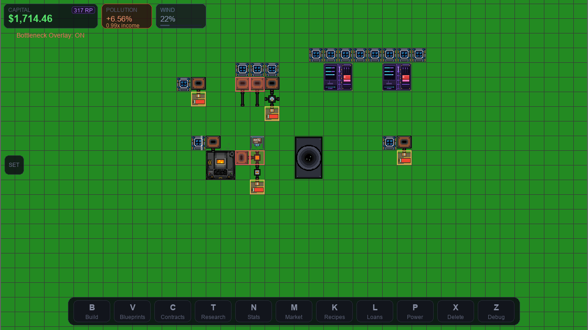
*Press `O` to highlight every stalled machine at once.*

### "My machine isn't producing anything."

Click it and read the status line at the top of the panel.

| Status | What it means | Fix |
|---|---|---|
| `NO POWER` | Stored power is zero | Wire it to a generator with `P`, or add generation |
| `LOW POWER (n% speed)` | Getting less than it draws | Add generators; it runs proportionally slowly until then |
| `WAITING FOR ...` / `NEEDS ...` | An input buffer is empty | Connect the missing ingredient |
| `OUTPUT FULL` | Nothing is taking its product away | Give it somewhere to push to |
| `RUNNING` | It is working | The problem is elsewhere in the chain |

### "How many of X do I need for one Y?"

Click the machine: its panel lists the ingredients for whatever it is set to
make. For whole chains, `tutorial/README.md` has the exact whole-number ratios -
for example 10 Iron Drills : 2 Coal Drills : 2 Furnaces : 1 Ingot Molder.

### "My machine keeps saying it needs something."

Machines deeper in the tree take **two or three separate input lines**, each on
its own port. A Raw Mill wants gravel, limestone *and* clay in three different
squares; a Water Treatment Plant making table salt needs water fed into **both**
of its ports. Press `Z`: every green marker is a separate line you have to
connect. The machine panel's status line names whichever ingredient is missing.

### "My machine isn't receiving inputs."

1. Press `Z`. The receiving machine's **green** marker shows exactly which tile
   accepts items, and from which side.
2. Items must arrive **into that tile, from that direction**. Feeding the wrong
   tile of a big machine does nothing - most multi-tile machines accept only on
   one or two specific squares along one edge.
3. Check the sender's **red** marker actually points at that green tile.
4. Check the item is one the port accepts. The machine panel's **BUFFERS**
   section names what each buffer takes.
5. If you rotated either machine, its ports rotated too - press `Z` again and
   re-read them.

### "My output isn't going anywhere."

The red marker shows the single tile and direction the machine pushes. If that
square is empty ground, the machine fills its output buffer and stops. Put a
pipe, a machine or a depot there. Machines with an **orange** marker have a
second output (a by-product) that also has to go somewhere, or it will eventually
back up and stall the machine - a **Liquid Burner** is the usual disposal.

### "My machines aren't connected."

Adjacency alone is not a connection. The output tile of A must be next to the
input tile of B **and** pointing at it. Turn on `Z` and check the two markers
face each other. Rotate with `R` before placing to line them up.

### "My factory has no power."

* Power is **explicit**. A generator sitting next to a machine does nothing until
  you wire them in power mode (`P`).
* In power mode, click the generator first - the square drawn is its whole range.
  Anything outside it will refuse with *"Out of range!"*.
* To reach further, chain **LV / MV / HV Poles**: generator -> pole -> machine.
* Check the Statistics panel (`N`): if **Consumption** exceeds **Generation** your
  whole factory runs slowly.
* A pole in the middle of a run showing ~0 stored is **normal** - it is relaying,
  not hoarding. Look at the end of the run instead.
* **A Coal Generator whose own coal drill is wired to it will never start.** Power
  that drill from a Solar Panel instead.

### "My blueprint isn't working."

* Blueprints capture machines whose **origin** (top-left tile) falls inside the
  drag box. Drag generously around large machines.
* Pasting skips anything you cannot afford or have not researched. The message
  after pasting says how many were skipped.
* Power links are only captured when **both ends** are inside the selection.
  Select the generator *and* the machines it feeds.
* Nothing pastes onto occupied ground - clear the area first.

### "Research isn't unlocking."

* Check the node's own text: `Need N more` means RP, a `<- Something` line means a
  missing prerequisite.
* If RP has stopped rising entirely, you have hit the **Research Station 1 soft
  cap** (200 RP for one station, 317 for two, 400 for three). Build another
  station or move up to Research Station 2.
* A research station with no power produces nothing - it needs 900 ME/s, about
  four solar panels.
* Machines unlock the moment a tech completes; if a machine is still missing from
  the build panel, clear the search box - the filter persists between openings.

### "My exhaust stack isn't working."

It probably is. Exhaust Stacks have **no inputs and no power**; they simply
remove 5.4 %/h while they exist. To confirm:

1. Click the stack - the panel shows **AIR SCRUBBING -> Removing: -5.400 %/h**.
2. Press `N` - the **POLLUTION** section shows the total **Scrubbed** figure,
   which should include every stack you own.

If pollution is still climbing, your emissions simply exceed your cleaning:
compare **Emitted** and **Scrubbed** in the same panel and add capacity.

### "My scrubber isn't working."

Click it and read the status line:

* **ACTIVE** with a "Removing" figure - it is working.
* **IDLE - needs full power to scrub** - wire it to a generator with `P`. A
  Scrubber needs its **full** 5,000 ME/s.
* A "Removing" figure lower than "Rated" - it is underpowered and scrubbing
  proportionally less. Add generation.
* **RESIDUE FULL - pipe it to a Liquid Burner** - the waste it captured has
  backed up and it has stopped. Press `Z`: the red marker on its bottom-left
  tile is where the residue leaves. Run a pipe from there to a **Liquid
  Burner**. This is the most common reason a Scrubber that *was* working quietly
  stops.

### "My statistics are incorrect."

* **Income $/min** is a 60-second rolling average and reads $0 until a depot has
  actually sold something.
* **POWER** on the statistics panel is *installed capacity* - total generator
  output versus total machine draw - not live flow. A machine can still be
  unpowered while the totals look healthy, if it is simply not wired.
* **Pollution** figures are per-hour rates derived from the current tick, so they
  change as machines start and stop.

### "The camera runs away while I type."

Fixed - W/A/S/D no longer pan while a search box, blueprint name field or the
console has focus. If it still happens, press `Esc` to drop focus.

### "Protesters are blocking my trucks."

Pollution has passed the threshold. Sales stop until it falls. Build Scrubbers
and Exhaust Stacks, and consider switching coal generation for wind or solar. A
loan (`L`) is often the fastest way out.

---

---

## Appendix - what a working factory looks like

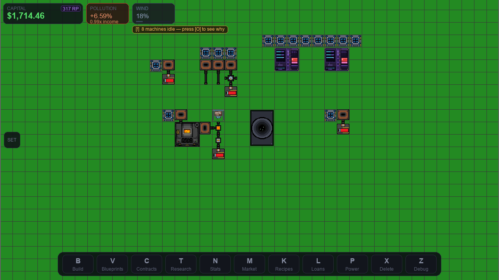
*The end state of the reference playthrough. Left to right: the starter drill and
depot; three drills merged into one depot; the coal generator with its own
solar-fed drill, and the iron chain running below it; an exhaust stack; and on
the right, a blueprint-pasted copy of the solar-plus-drill cell, wiring intact.
Along the top, two research stations and their solar rows. $1,714 in hand,
317 RP banked.*

---

*This manual documents the game as verified by end-to-end play testing: every
figure in it was read out of the running game rather than from the source.*
