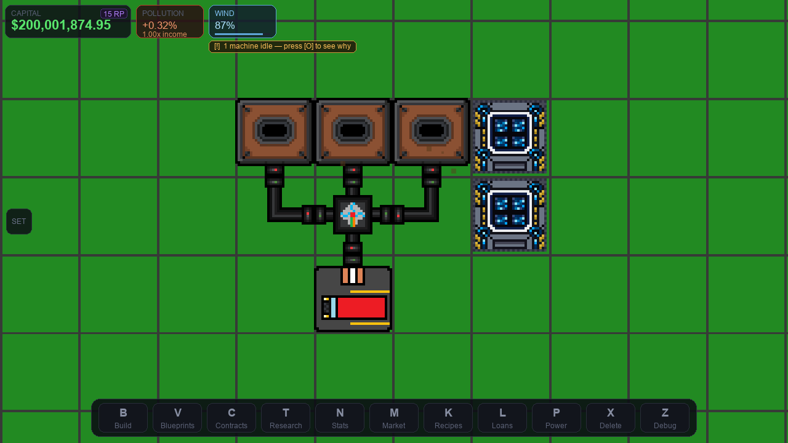
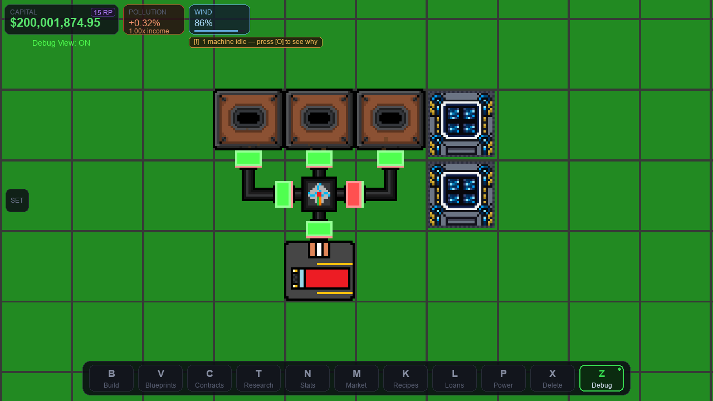
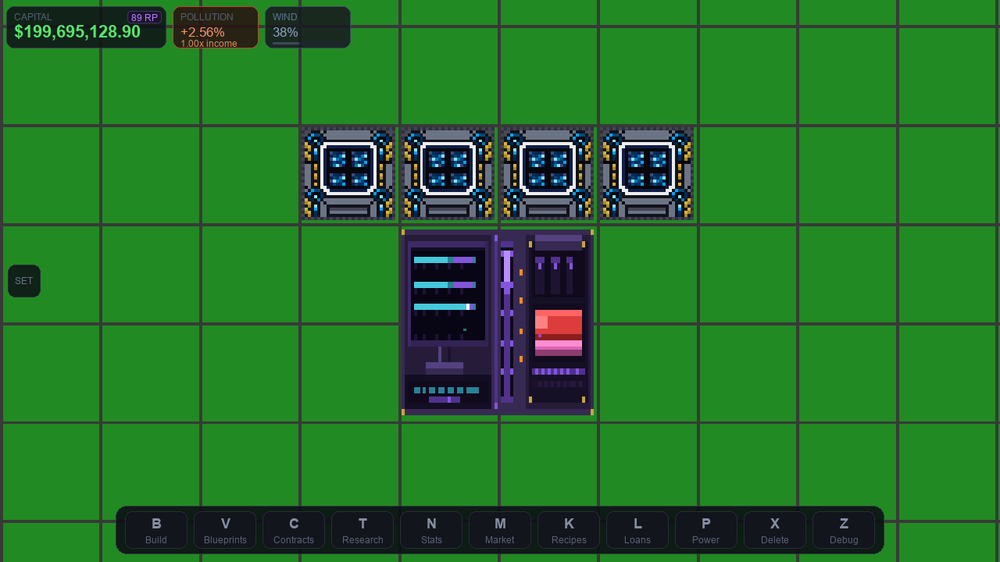
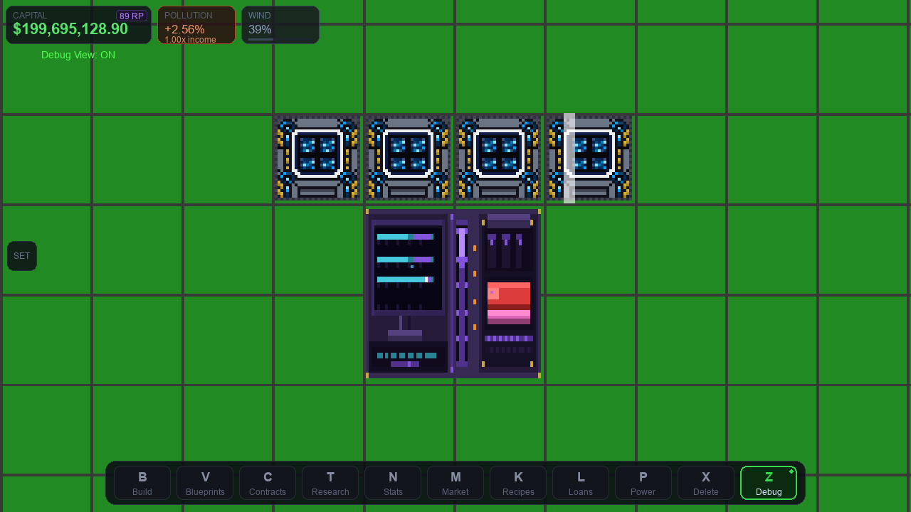
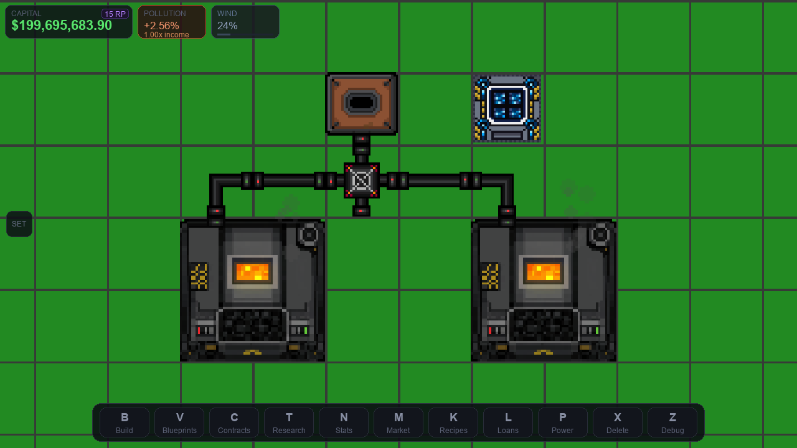
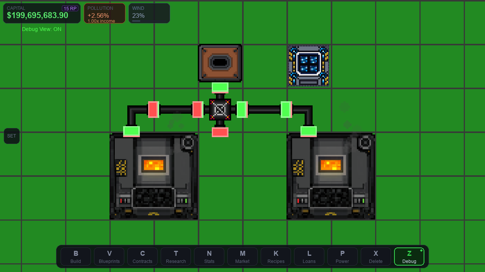
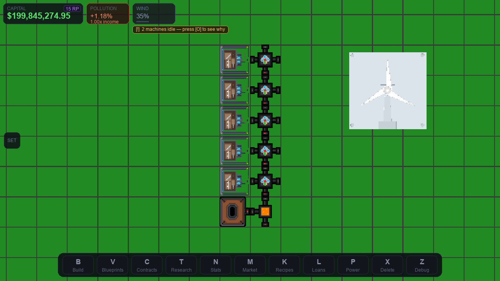
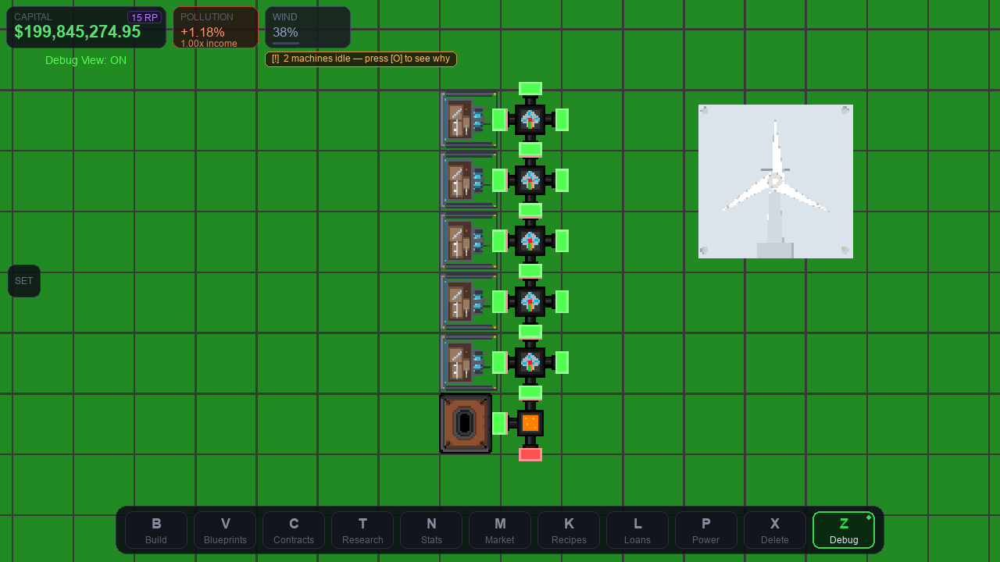
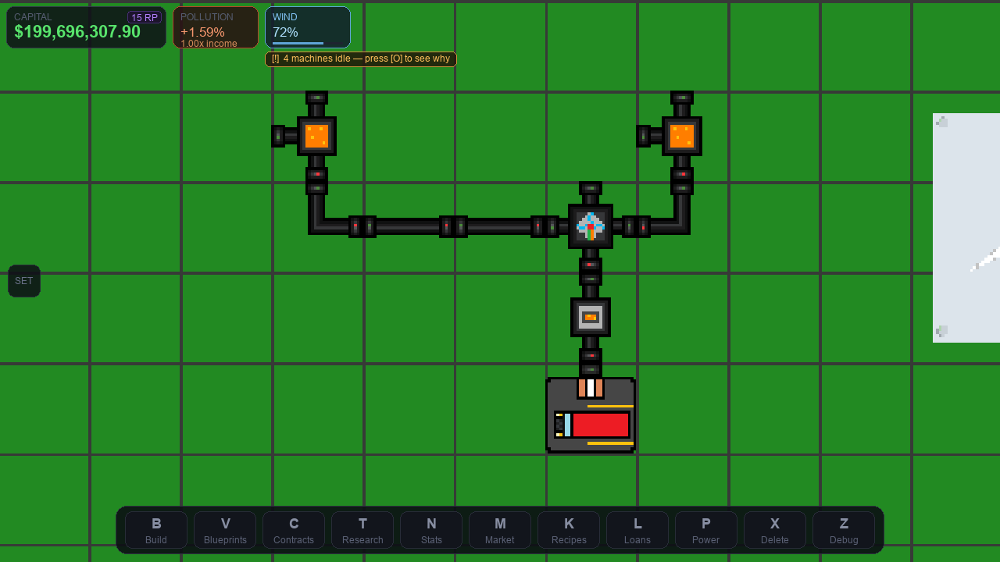
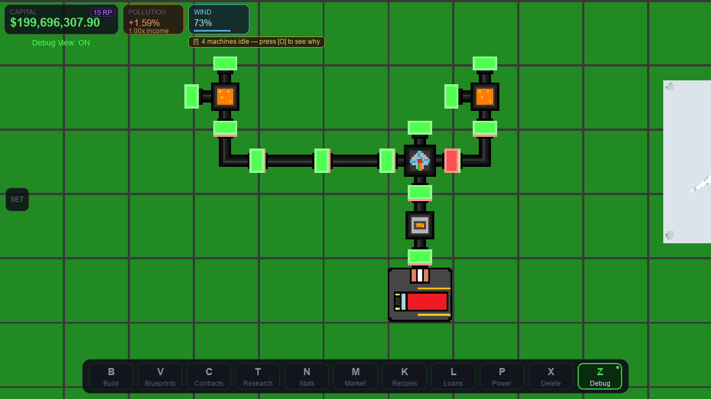

# Industrial Capitalist - Blueprint Tutorial

Reference layouts with **exact** production ratios. Nothing here is rounded:
every cell consumes precisely what the stage before it produces, so no machine
starves and no buffer backs up.

Each design was built in the running game, left to run, and verified before its
blueprint string was exported - the numbers under "Verified" are readings taken
from the live world, not estimates.

---

## How to use a blueprint string

1. Open the blueprint library with **V**.
2. Click **IMPORT STRING**. If the string is already on your clipboard it is
   pasted for you; otherwise press **Ctrl+V** (**Cmd+V** on macOS) or type it in.
3. Press **Enter**. The layout appears in your library.
4. Select it, click **PLACE**, then click the world to stamp it down.

Machines you have not researched yet, or cannot afford, are skipped - the game
tells you how many. Power wiring inside the blueprint comes back with it.

### Exporting your own

Select any saved blueprint and click **EXPORT STRING**. The string is copied to
your clipboard *and* written to `data/blueprint_strings/<name>.txt`, so it
survives even if your system clipboard is unavailable.

Strings look like `IC1:eNqrVspTslJ...`. The `IC1` prefix is the format version;
whitespace and line breaks inside a string are ignored, so it is safe to paste
one out of a chat window or a text file.

---

## Reading the diagrams

Press **Z** in game to show the same markers used in the port screenshots:

| Marker | Meaning |
|---|---|
| **Green** | an input - items must arrive **into that tile, from that side** |
| **Red** | the main output - items leave in that direction |
| **Orange** | a secondary output (a by-product) that also needs somewhere to go |

---

## 1. Coal Outpost

*Three Coal Drills into one Van Depot - the depot's exact intake.*



| | |
|---|---|
| **Ratio** | 3 Coal Drills : 1 Van Depot |
| **Why it balances** | Coal Drill 30/min each = 90/min. Van Depot sells 12 every 8 s = 90/min. |
| **Footprint** | 4 x 3 tiles |
| **Build cost** | $1,204 |
| **Power** | 360 ME/s - two Solar Panels (560 ME/s). |
| **Notes** | Cheapest sustainable income in the game. |

**Parts**

| Machine | Count |
|---|---:|
| Coal Drill | 3 |
| Solar Panel | 2 |
| L-Pipe R | 1 |
| Merger | 1 |
| L-Pipe L | 1 |
| Van Depot | 1 |

**Ports**



**Verified in game**

- depot: stored=coal amount=12 total_sold=198
- blueprint captured all 9 machines

**Blueprint string**

```
IC1:eNqrVspTslJyzk_MUfAvLSnILy5R0lEqV7Iy0VHKULIy1lHKVbKKjjbQMdAx0gGR0bGxOtGGqFwjVK4xkGFoCOGDdEI0xIKkgBI6JsjmGOqYIZtjqGOKbI4hwhwjqAmGQJuMYWpiawGtqi41
```

Also saved as [`blueprints/coal-outpost.txt`](blueprints/coal-outpost.txt).

---

## 2. Research Cluster

*The smallest solar farm that keeps a Research Station 1 running.*



| | |
|---|---|
| **Ratio** | 4 Solar Panels : 1 Research Station 1 |
| **Why it balances** | Research Station 1 draws 900 ME/s. Four Solar Panels make 1,120 ME/s. |
| **Footprint** | 4 x 3 tiles |
| **Build cost** | $555 |
| **Power** | Net +220 ME/s. |
| **Notes** | 0.5 RP/s, capped at 200 RP for one station. Build more to raise the cap. |

**Parts**

| Machine | Count |
|---|---:|
| Solar Panel | 4 |
| Research Station 1 | 1 |

**Ports**



**Verified in game**

- station: power=3000.00
- blueprint captured all 5 machines

**Blueprint string**

```
IC1:eNqrVspTslIKSi1OTSxKzlBwziktLkktUtJRKleyMtFRylCyMtZRylWyio420DHQMTTUAVHR0UY6RrGxsTrRhtgEjbAJGmPXDoTGEEGgQC0AXsUjwQ
```

Also saved as [`blueprints/research-cluster.txt`](blueprints/research-cluster.txt).

---

## 3. Coal Power Block

*One Coal Drill running two Coal Generators - no surplus, no starvation.*



| | |
|---|---|
| **Ratio** | 1 Coal Drill : 1 Splitter : 2 Coal Generators |
| **Why it balances** | Coal Drill 30/min. Each Coal Generator burns 0.25/s = 15/min. Two generators = 30/min exactly. Output 14,000 ME/s. |
| **Footprint** | 6 x 4 tiles |
| **Build cost** | $624 |
| **Power** | Produces 14,000 ME/s; the drill itself costs 120 ME/s. |
| **Notes** | Pollutes 21.6 %/h. One Scrubber (28.8 %/h) covers it - remember the Scrubber needs a Liquid Burner under its residue port, or it clogs and stops. |

**Parts**

| Machine | Count |
|---|---:|
| Pipe | 2 |
| Coal Generator | 2 |
| Coal Drill | 1 |
| Splitter | 1 |
| L-Pipe R | 1 |
| L-Pipe L | 1 |
| Solar Panel | 1 |

**Ports**



**Verified in game**

- gen A: coal_buffer=0.44 power=7000
- gen B: coal_buffer=0.91 power=7000
- blueprint captured all 9 machines

**Blueprint string**

```
IC1:eNqrVspTslJyzk_MUQjIL08tUnDKyU_OVtJRKleyMtNRylCyMtFRylWyio420jHQAWEDnejYWJ1oEyDD0BDCB8nFggSBQjomOkbmcFWGOiCIJGAE5JojTDEGy1simWqoY4rEB1lpiGIrMj-2FgDDxC4b
```

Also saved as [`blueprints/coal-power-block.txt`](blueprints/coal-power-block.txt).

---

## 4. Iron Smelter Cell

*Five Iron Drills and one Coal Drill feeding a single Furnace.*



| | |
|---|---|
| **Ratio** | 5 Iron Drills : 1 Coal Drill : 1 Furnace |
| **Why it balances** | Iron Drill 6/min x5 = 30/min. Furnace eats 30 ore + 30 coal per minute; a Coal Drill makes exactly 30/min. |
| **Footprint** | 2 x 6 tiles |
| **Build cost** | $6,600 |
| **Power** | 6,620 ME/s - one Coal Generator covers it. |
| **Notes** | The building block of every metal chain. Two of these feed one Ingot Molder. |

**Parts**

| Machine | Count |
|---|---:|
| Iron Drill | 5 |
| Merger | 5 |
| Coal Drill | 1 |
| Furnace | 1 |

**Ports**



**Verified in game**

- furnace: input_buffer=8.00 coal_buffer=10 output_buffer=8 output_item=liquid_iron
- blueprint captured all 12 machines

**Blueprint string**

```
IC1:eNpdzLEKgCAABNBfiZtvULMo16bmRnEUGtQggobo36uhSKe748EdSDAY1yVVU_Rh82s1-BBA7DCKmGFaIsJYKyjYsX_COkcr79Lym4KyYJmzKljlXBdc56wL1jk3992fG_Yvu_MCd1A3Rg
```

Also saved as [`blueprints/iron-smelter-cell.txt`](blueprints/iron-smelter-cell.txt).

---

## 5. Ingot Line

*Two Furnaces into one Ingot Molder, then a Van Depot.*



| | |
|---|---|
| **Ratio** | 2 Furnaces : 1 Ingot Molder : 1 Van Depot |
| **Why it balances** | Furnace 30 liquid/min each = 60/min. Ingot Molder eats 4 liquid per 4 s = 60/min and makes 30 ingots/min. A Van Depot clears 90/min. |
| **Footprint** | 5 x 4 tiles |
| **Build cost** | $2,834 |
| **Power** | 2,500 ME/s for the molder and furnaces (drills not counted). |
| **Notes** | Iron ingots are worth $65.54 against raw iron at $5.80. |

**Parts**

| Machine | Count |
|---|---:|
| Furnace | 2 |
| Pipe | 2 |
| L-Pipe R | 1 |
| Merger | 1 |
| L-Pipe L | 1 |
| Ingot Molder | 1 |
| Van Depot | 1 |

**Ports**



**Verified in game**

- furnace A: output_buffer=0 output_item=None
- molder: input_buffer=2 output_buffer=0 output_item=None
- depot: stored=None amount=0 total_sold=66
- blueprint captured all 9 machines

**Blueprint string**

```
IC1:eNqrVspTslLyzEvPL1HwycxLVdJRKleyMtVRylCyMtFRylWyio420DHQsdQBkdGxsTrRJqhcAx1DHRME11AHBC3hfCM0vjGQZ4ZsmKGOqQ6SLFC9ATIfBKHc2FoAdXwpoA
```

Also saved as [`blueprints/ingot-line.txt`](blueprints/ingot-line.txt).

---

## Ratio reference

The numbers every design above is built from. Rates are per minute at full power.

| Machine | Consumes | Produces |
|---|---|---|
| Coal Drill | - | 30 coal |
| Iron Drill | - | 6 raw_iron |
| Copper Drill | - | 9 raw_copper |
| Water Pump | - | 30 water |
| Quarry | - | 10 limestone (or clay / sand / earth_fragment) |
| Tree Farm | - | 7.5 oak_log |
| Furnace | 30 ore + 30 coal | 30 liquid metal |
| Ingot Molder | 60 liquid metal | 30 ingots |
| Blast Furnace | 12 iron_ingot + 48 coal | 24 steel |
| Grinder | 20 soil | 5 gravel |
| Raw Mill | 10 gravel + 10 limestone + 10 clay | 20 rawmix + 10 aggregate |
| Industrial Kiln | 6 rawmix + 6 coal | 6 cement |
| Press | 15 iron_ingot | 15 iron_plate |
| Roller | 15 steel | 15 steel_rod |
| Sawmill | 3 oak_log | 6 cut_oak_log |
| Coal Generator | 15 coal | 7,000 ME/s |
| Van Depot | - | sells 12 every 8 s (90/min) |
| Huge Truck Depot | - | sells 350 every 16 s, 1.25x bonus |

### Whole-chain ratios

Derived from the table above; these are the smallest whole-number sets that
balance exactly.

| Chain | Ratio |
|---|---|
| Iron ingots | **10** Iron Drill : **2** Coal Drill : **2** Furnace : **1** Ingot Molder |
| Steel | **20** Iron Drill : **4** Furnace : **2** Ingot Molder : **5** Blast Furnace (+ 12 Coal Drill) |
| Cement | **2** Grinder : **1** Quarry (limestone) : **1** Quarry (clay) : **1** Raw Mill : **3** Industrial Kiln |
| Coal power | **1** Coal Drill : **2** Coal Generator |
| Research | **4** Solar Panel : **1** Research Station 1 |

> **Research Station 1 has a soft cap.** One station stops generating at 200 RP,
> two at 317, three at 400, four at 464. Its panel shows the current cap. To go
> further, build more stations or move up to Research Station 2.

---

## Scaling advice

* **Depots are the expensive part.** A Van Depot costs $500 against a $150 Coal
  Drill, and it clears 90 items/min - so feed it three drills through a merger
  rather than buying one per drill.
* **Chain the cells.** Two Iron Smelter Cells feed exactly one Ingot Line. Two
  Ingot Lines feed enough iron ingots for one Blast Furnace pair.
* **Bootstrap coal power from solar.** A Coal Generator whose own drill is wired
  to it will never start - neither can move first. Put one Solar Panel on that
  drill, as the Coal Power Block does.
* **Poles relay, they do not store.** A pole in the middle of a run reads ~0;
  that is normal. Only the last pole in a run holds a charge.
* **Watch pollution.** The Coal Power Block emits 21.6 %/h. One Scrubber removes
  28.8 %/h while powered; an Exhaust Stack removes 5.4 %/h for free. The
  Statistics panel (**N**) shows emitted, scrubbed and net side by side.
* **A Scrubber needs plumbing, a Stack does not.** The Scrubber captures what it
  removes and fills with residue at 7.5/min; when that backs up it stops
  scrubbing. Put a **Liquid Burner** directly under its bottom-left tile. The
  Exhaust Stack disperses instead, so it never clogs - that is the trade-off.
